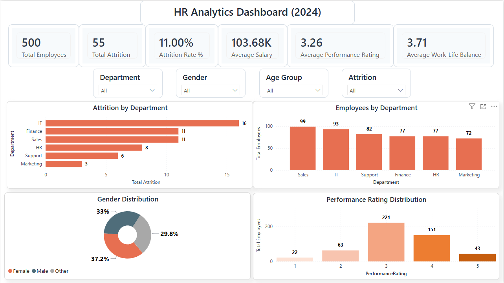
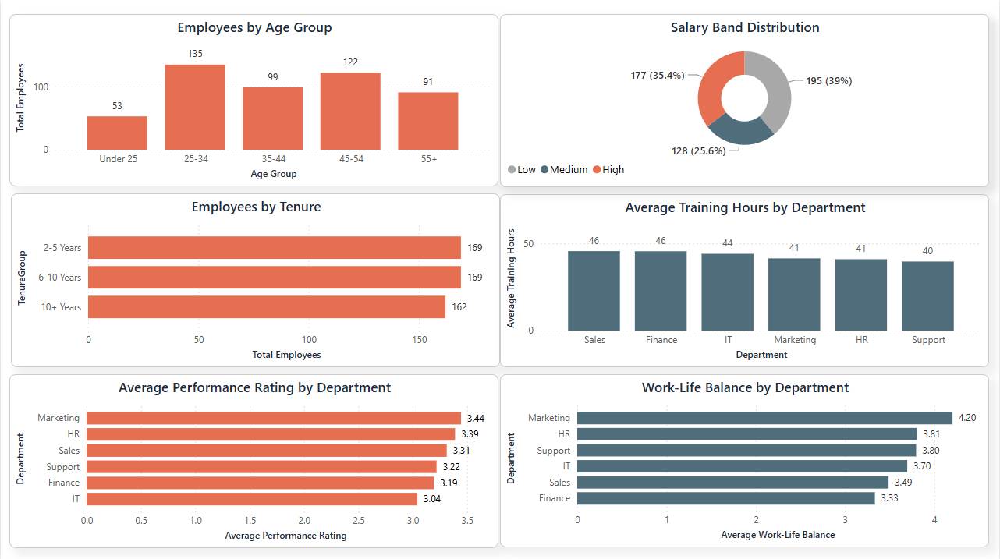

# 👨‍💼 HR Analytics Dashboard | Power BI + MySQL + DAX

> An interactive HR Analytics Dashboard built using **Power BI, MySQL, and DAX** to analyze employee demographics, attrition, salary distribution, performance, training, and workforce insights.

---

## 📌 Project Overview

Human Resources departments generate large volumes of employee data, but turning that data into actionable insights is often challenging.

This project demonstrates how HR data can be transformed into an executive dashboard that helps organizations monitor workforce health, employee performance, compensation trends, training effectiveness, and attrition risk.

The dashboard was developed using **MySQL for data preparation**, **Power BI for visualization**, and **DAX for business calculations**, following a real-world analytics workflow.

---

# 📊 Dashboard Preview

## Executive Dashboard



---

## Detailed Employee Analytics



---

# 🎯 Business Objectives

- Analyze workforce demographics
- Monitor employee attrition
- Evaluate salary distribution
- Track department performance
- Measure employee training effectiveness
- Understand work-life balance across departments
- Support HR decision-making through interactive dashboards

---

# 📈 Dashboard KPIs

| KPI | Description |
|------|-------------|
| 👥 Total Employees | Total workforce |
| 🚪 Total Attrition | Employees at attrition risk |
| 📉 Attrition Rate | Percentage of employee attrition |
| 💰 Average Salary | Average monthly employee salary |
| ⭐ Average Performance Rating | Overall employee performance |
| ⚖️ Average Work-Life Balance | Employee work-life balance score |

---

# 📊 Dashboard Features

### Executive Dashboard

- Employee Overview
- Attrition Analysis
- Gender Distribution
- Department-wise Employee Count
- Department-wise Attrition
- Performance Distribution
- Interactive Filters

---

### Detailed Employee Analytics

- Employee Age Distribution
- Salary Band Distribution
- Employee Tenure Analysis
- Training Hours by Department
- Performance Rating by Department
- Work-Life Balance by Department

---

# 💡 Key Business Insights

- Workforce distribution across departments
- Employee age demographics
- Salary segmentation into Low, Medium, and High bands
- Department-wise training participation
- Performance comparison across departments
- Work-life balance trends
- Attrition monitoring for HR decision-making

---

# ⚙️ Project Workflow

```
Dataset
      │
      ▼
MySQL
(Data Cleaning & Feature Engineering)
      │
      ▼
Export Clean Dataset
      │
      ▼
Power BI
(DAX + Dashboard Development)
      │
      ▼
Interactive HR Analytics Dashboard
```

---

# 🛠️ Tech Stack

- Power BI Desktop
- MySQL
- DAX
- SQL
- Microsoft Excel
- GitHub

---

# 📁 Repository Structure

```
HR-Analytics-Dashboard
│
├── Dashboard
│   └── HR_Analytics_Dashboard.pbix
│
├── Dataset
│   └── HR_Employee_Data.csv
│
├── Images
│   ├── Executive_Dashboard.png
│   └── Detailed_Employee_Analytics.png
│
├── SQL
│   └── HR_Analysis.sql
│
├── HR_Executive_Theme.json
│
└── README.md
```

---

# 🚀 How to Use

1. Download the repository.
2. Open the `.pbix` file using Power BI Desktop.
3. Import the custom theme (`HR_Executive_Theme.json`) if desired.
4. Explore the interactive dashboard using the available slicers.

---

# 🌟 Skills Demonstrated

- Data Cleaning
- SQL Querying
- Feature Engineering
- DAX Measures
- Dashboard Design
- Data Modeling
- HR Analytics
- Business Intelligence
- Interactive Reporting
- Data Visualization

---

# 🔮 Future Enhancements

- Employee Attrition Prediction
- Department Performance Trends
- Salary Forecasting
- Employee Promotion Analysis
- Recruitment Analytics
- Workforce Planning Dashboard

---

# 👩‍💻 Author

**Naga Lakshmi Devanaboina**

📍 Visakhapatnam, Andhra Pradesh, India

🔗 GitHub: https://github.com/nagalakshmi-dnl

---

## ⭐ If you found this project helpful, consider giving it a Star!
